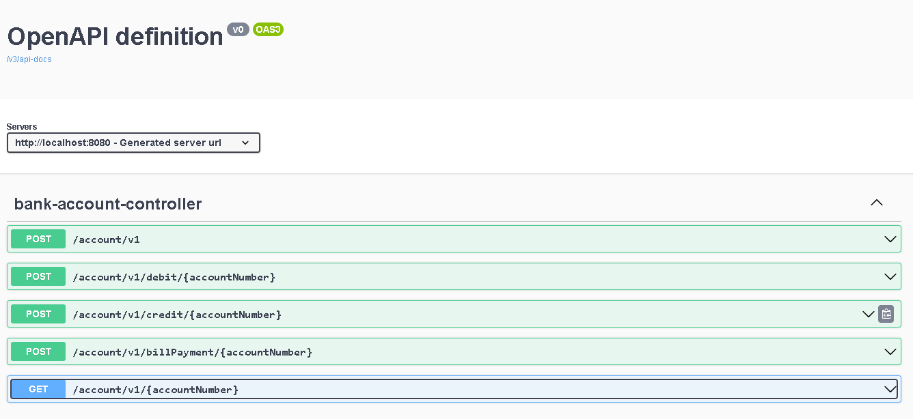

# Spring Boot Basit Bankacılık

Bu projede, herhangi sayıda işlemi işleyebilen, banka hesaplarını yönetebilen bir bankacılık hizmeti oluşturuldu. Bu hizmet, bir bankanın iç işleyişini modelleyen daha büyük bir hizmet koleksiyonunun bir parçasıdır. "Banka hesabı" için hizmetler, banka hesaplarının aşırı basitleştirilmiş bir dünyada nasıl çalışabileceğini basit bir şekilde modellemektedir.

## Özellikler

- **Banka Hesabı Yönetim :** Hesap sahibinin adını, hesap numarasını ve hesabın bakiyesini korur.
- **Hesap İşlemleri :**  Kredi ve borç işlemleri için endpoint'ler sağlar. 
## Teknolojiler
- **Spring Boot:**
- **JPA (Java Persistence API):** 
- **Doğrulama (Validation):** 
- **Web:** Spring Boot Web,
- **Spring Boot DevTools:** 
- **PostgreSQL:** 
- **Project Lombok:** 
- **OpenAPI (Swagger):** OpenAPI belgelerini oluşturmak ve API'yi görselleştirmek için kullanılır. API dokümantasyonunu kolaylaştırır.
- **Maven:** Bağımlılık yönetimi ve proje yapılandırması için kullanılır.

## Swagger Nasıl Kullanılır

1. Projeyi bilgisayarınıza klonlayın.
2. Uygulamayı başlatmak için `mvn spring-boot:run` komutunu kullanın.
3. Tarayıcınızda http://localhost:8080/swagger-ui/index.html#/ adresine gidin.

## Swagger EndPoint Dökümantasyonu

   

